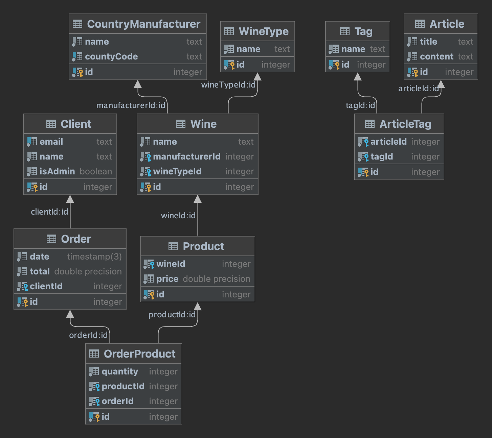

## Климачёва Екатерина Николаевна М33041
### Winely - это блог-магазин о вине
https://winely.onrender.com

Диаграма моделей моего приложения:

Используемые модели:

- Вино - оснавная сущность, которая будет включаться в карточку продукта. Содержит в себе информацию о сорте вина,
производителе и свое название.
- Продукт - то, что будет продаваться в магазине. Ссылается на вино.
- Страна-производитель - строка, содержащая в себе название страны
- Сорт вина - строка, описывающая сорт вина (например: красное сухое, игристое и т.п.)
- Покупатель - сущность совершающая покупки. Хранит информацию о своем имени, адресе, почте.
- Админ - сущность, осуществляющая контроль над добавлением и продажей товара.
